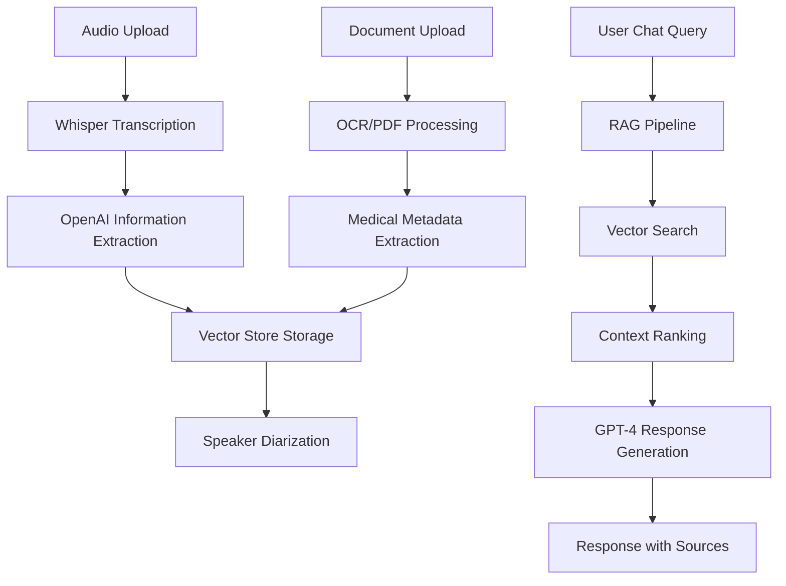

# Documentación Completa - ElSol Challenge

## Resumen Ejecutivo

Esta documentación proporciona un análisis exhaustivo del proyecto ElSol Challenge, una plataforma médica inteligente que combina transcripción de audio, procesamiento de documentos, almacenamiento vectorial y un sistema de chat RAG para crear un asistente médico completo.

El sistema está construido como un **monolito modular** usando Python/FastAPI en el backend y React/TypeScript en el frontend, diseñado para evolucionar gradualmente hacia microservicios cuando sea necesario.

## Estructura de la Documentación

### 📋 Documentos por Servicio

#### [01_Servicio_Whisper_Transcripcion.md](./01_Servicio_Whisper_Transcripcion.md)
- **Servicio de Transcripción de Audio**
- Utiliza Whisper local (OpenAI) para transcripción offline
- Maneja validación de archivos, procesamiento asíncrono y cálculo de confianza
- Integración con vector store y speaker diarization
- Soporte para archivos WAV y MP3 hasta 25MB

#### [02_Servicio_OpenAI_Extraccion.md](./02_Servicio_OpenAI_Extraccion.md)
- **Servicio de Extracción de Información**
- Usa Azure OpenAI para extraer datos estructurados y no estructurados
- Prompts especializados para información médica
- Validación de respuestas y manejo de errores
- Genera respuestas para el sistema RAG

#### [03_Servicio_Vector_Store.md](./03_Servicio_Vector_Store.md)
- **Servicio de Almacenamiento Vectorial**
- ChromaDB con sentence-transformers para embeddings
- Búsqueda semántica avanzada con filtros por metadata
- Búsquedas especializadas por paciente y condición médica
- Similarity scoring y ranking de resultados

#### [04_Servicio_Chat_RAG.md](./04_Servicio_Chat_RAG.md)
- **Sistema de Chat con RAG (Retrieval-Augmented Generation)**
- Pipeline completo: análisis → búsqueda → ranking → generación
- Detección de intenciones médicas específicas
- Extracción de entidades (pacientes, condiciones, síntomas)
- Sugerencias de seguimiento contextuales

#### [05_Servicio_OCR_Documentos.md](./05_Servicio_OCR_Documentos.md)
- **Procesamiento de Documentos Médicos**
- OCR para imágenes (Tesseract) y extracción de PDFs (PyPDF2)
- Validación de formatos y extracción de metadata médica
- Integración con vector store para búsqueda unificada
- Soporte para PDF, JPG, PNG, TIFF hasta 10MB

#### [06_Servicio_Speaker_Diarization.md](./06_Servicio_Speaker_Diarization.md)
- **Diferenciación de Hablantes**
- Clasificación automática promotor vs. paciente
- Análisis híbrido: características de audio + análisis semántico
- Estadísticas de participación y cambios de hablante
- Fallback a análisis solo de texto cuando no hay audio

### 🔌 Documentación de API

#### [07_Endpoints_API_Documentacion.md](./07_Endpoints_API_Documentacion.md)
- **Documentación Completa de Endpoints**
- `/upload-audio`: Carga y procesamiento de audio
- `/chat`: Sistema RAG para consultas médicas
- `/documents`: Procesamiento de documentos médicos
- `/vector-store`: Gestión del almacenamiento vectorial
- `/health`: Monitoreo y verificación de estado
- Esquemas de request/response, validaciones y códigos de error

### 🗄️ Documentación de Datos

#### [08_Schemas_Base_Datos.md](./08_Schemas_Base_Datos.md)
- **Modelos y Esquemas de Base de Datos**
- Modelo `AudioTranscription`: Transcripciones y metadata médica
- Modelo `Document`: Documentos procesados con OCR
- Estructura de datos JSON para información médica
- Diagramas ER y optimizaciones de base de datos
- Estrategias de migración y backup

### 🏗️ Documentación Arquitectónica

#### [09_Arquitectura_General_ElSol.md](./09_Arquitectura_General_ElSol.md)
- **Arquitectura Completa del Sistema**
- Diagramas de alto nivel con Mermaid
- Pipeline de procesamiento de audio y documentos
- Sistema RAG y flujo de datos
- Patrones de diseño implementados
- Estrategias de escalabilidad y monitoreo

#### [10_Decisiones_Arquitectonicas_Migracion.md](./10_Decisiones_Arquitectonicas_Migracion.md)
- **Decisiones y Estrategia de Migración**
- Justificación de tecnologías elegidas
- Preparación para microservicios
- Estrategia de migración gradual (Strangler Fig Pattern)
- Timeline y métricas de éxito

## Arquitectura del Sistema

### Stack Tecnológico

**Backend:**
- **Framework**: FastAPI (Python)
- **Base de Datos**: SQLite (dev) / PostgreSQL (prod)
- **ORM**: SQLAlchemy con Alembic
- **Vector DB**: ChromaDB
- **Embeddings**: sentence-transformers
- **Transcripción**: OpenAI Whisper (local)
- **IA**: Azure OpenAI GPT-4
- **OCR**: Tesseract + PyPDF2

**Frontend:**
- **Framework**: React 18 + TypeScript
- **Styling**: Tailwind CSS
- **Build Tool**: Vite
- **HTTP Client**: Axios
- **State Management**: React Hooks

### Flujo de Datos Principal



## Características Principales

### 🎤 Transcripción de Audio
- **Whisper Local**: Transcripción offline para privacidad médica
- **Formatos**: WAV, MP3 hasta 25MB
- **Idiomas**: Español con detección automática
- **Calidad**: Confidence scoring y validación

### 🤖 Extracción de Información
- **IA Médica**: Azure OpenAI especializado en datos médicos
- **Datos Estructurados**: Nombre, edad, diagnóstico, medicamentos
- **Datos No Estructurados**: Síntomas, contexto, emociones, urgencia
- **Validación**: Schemas Pydantic y rangos médicos válidos

### 🔍 Almacenamiento Vectorial
- **ChromaDB**: Base de datos vectorial persistente
- **Embeddings**: all-MiniLM-L6-v2 (384 dimensiones)
- **Búsqueda Semántica**: Similarity search con filtros
- **Metadata Rica**: Paciente, diagnóstico, síntomas, fechas

### 💬 Chat Inteligente (RAG)
- **Intenciones**: Paciente específico, listas por condición, síntomas
- **Entidades**: Extracción automática de nombres, condiciones médicas
- **Contexto**: Ranking multi-factor para relevancia
- **Respuestas**: Generación contextual con fuentes citadas

### 📄 Procesamiento de Documentos
- **OCR**: Tesseract para imágenes médicas
- **PDF**: PyPDF2 para documentos digitales
- **Formatos**: PDF, JPG, PNG, TIFF hasta 10MB
- **Metadata**: Extracción automática de información médica

### 👥 Diferenciación de Hablantes
- **Clasificación**: Promotor de salud vs. Paciente
- **Análisis Híbrido**: Audio features + análisis semántico
- **Estadísticas**: Tiempo de participación, cambios de hablante
- **Fallback**: Análisis solo de texto cuando no hay audio

## Casos de Uso Principales

### 📋 Para Profesionales Médicos
- **Transcripción Automática**: Documentar consultas sin typing
- **Búsqueda Inteligente**: "¿Qué pacientes tienen diabetes?"
- **Revisión de Casos**: Acceso rápido a historiales
- **Análisis de Comunicación**: Estadísticas de participación

### 🔎 Para Análisis Médico
- **Extracción de Tendencias**: Síntomas más comunes
- **Seguimiento de Pacientes**: Evolución temporal
- **Calidad de Consultas**: Análisis de comunicación
- **Reporting**: Estadísticas de condiciones médicas

### 🏥 Para Gestión Hospitalaria
- **Eficiencia**: Reducir tiempo de documentación
- **Compliance**: Trazabilidad de conversaciones
- **Calidad**: Análisis de atención al paciente
- **Integración**: Preparado para sistemas hospitalarios

## Escalabilidad y Evolución

### Monolito Modular Actual
- **Desarrollo Rápido**: Un solo codebase, deployment simple
- **Consistencia**: Transacciones ACID garantizadas
- **Debugging**: Stack traces completos, fácil troubleshooting
- **Performance**: Comunicación in-process entre módulos

### Migración a Microservicios (Futuro)
- **Servicios Candidatos**: Transcription, Extraction, Knowledge, Chat
- **Estrategia**: Strangler Fig Pattern para migración gradual
- **Comunicación**: Event-driven con message queues
- **Datos**: Database per service con eventual consistency

## Seguridad y Compliance

### Privacidad Médica
- **Datos Locales**: Whisper ejecuta sin enviar datos externos
- **Encriptación**: Datos sensibles encriptados en tránsito
- **Audit Logs**: Trazabilidad de acceso a información
- **HIPAA Ready**: Preparado para compliance médico

### Arquitectura de Seguridad
- **Validación**: Input validation en todas las capas
- **Autenticación**: JWT tokens (preparado)
- **Autorización**: Role-based access control
- **Monitoreo**: Logging estructurado para auditoría

## Métricas y Monitoreo

### Performance Metrics
- **Latencia**: < 500ms p95 para consultas RAG
- **Throughput**: > 1000 requests/minuto
- **Transcripción**: < 2 minutos para audio de 5 minutos
- **Disponibilidad**: 99.9% uptime target

### Business Metrics
- **Precisión**: > 90% accuracy en extracción médica
- **Satisfacción**: Confidence scores de respuestas RAG
- **Productividad**: Reducción de tiempo de documentación
- **Adopción**: Métricas de uso por características

## Deployment y Operaciones

### Desarrollo Local
```bash
# Backend
cd backend
pip install -r requirements.txt
uvicorn app.main:app --reload

# Frontend  
cd frontend
npm install
npm run dev
```

### Producción
- **Containerización**: Docker + Docker Compose
- **Orquestación**: Kubernetes ready
- **CI/CD**: GitHub Actions pipeline
- **Monitoreo**: Prometheus + Grafana stack

## Roadmap Técnico

### Corto Plazo (Q1 2024)
- [ ] Optimización de performance
- [ ] Tests de integración completos
- [ ] Documentación de API (OpenAPI)
- [ ] Security hardening

### Medio Plazo (Q2-Q3 2024)
- [ ] Real-time transcription (WebSockets)
- [ ] Advanced analytics dashboard
- [ ] Multi-language support
- [ ] Mobile app integration

### Largo Plazo (Q4 2024+)
- [ ] Migración gradual a microservicios
- [ ] Advanced ML models para medicina
- [ ] Integration con sistemas hospitalarios
- [ ] Multi-tenancy y features enterprise

## Contribución y Mantenimiento

### Standards de Código
- **Python**: Black + isort + flake8 + mypy
- **TypeScript**: ESLint + Prettier
- **Tests**: pytest + Jest con coverage > 80%
- **Documentation**: Docstrings + type hints

### Git Workflow
- **Branching**: GitFlow con feature branches
- **Commits**: Conventional Commits
- **Reviews**: Pull Request requeridos
- **CI/CD**: Automated testing y deployment

## Conclusión

ElSol Challenge representa una solución médica moderna que combina las mejores prácticas de desarrollo de software con tecnologías de inteligencia artificial de vanguardia. La arquitectura monolítica modular permite desarrollo rápido mientras prepara el terreno para una evolución gradual hacia microservicios cuando el negocio lo requiera.

La documentación completa facilita el onboarding de nuevos desarrolladores, la comprensión del sistema por parte de stakeholders, y proporciona una guía clara para la evolución futura del proyecto.

**Documentos relacionados:**
- [Arquitectura General](./09_Arquitectura_General_ElSol.md)
- [Decisiones Arquitectónicas](./10_Decisiones_Arquitectonicas_Migracion.md)
- [Schemas de Base de Datos](./08_Schemas_Base_Datos.md)
- [Documentación de API](./07_Endpoints_API_Documentacion.md)
