# Arquitectura General - ElSol Challenge

## Visión General del Sistema

ElSol Challenge es una plataforma médica inteligente que combina transcripción de audio, procesamiento de documentos, almacenamiento vectorial y un sistema de chat RAG para proporcionar un asistente médico completo. La arquitectura está diseñada como un monolito modular que puede evolucionar hacia microservicios.

## Arquitectura de Alto Nivel

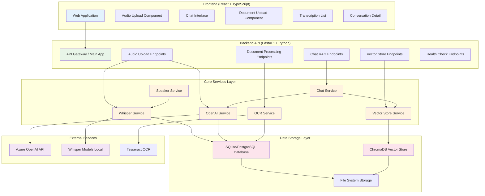

## Pipeline de Procesamiento de Audio

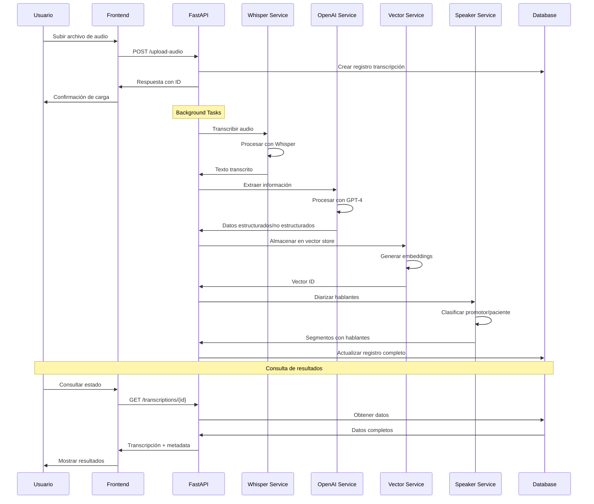

## Sistema RAG (Retrieval-Augmented Generation)

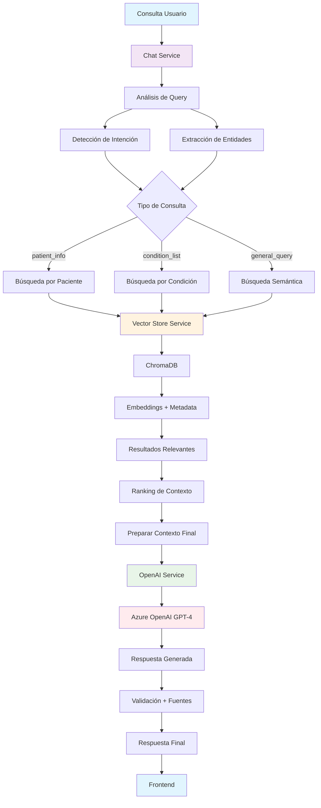

## Arquitectura de Datos

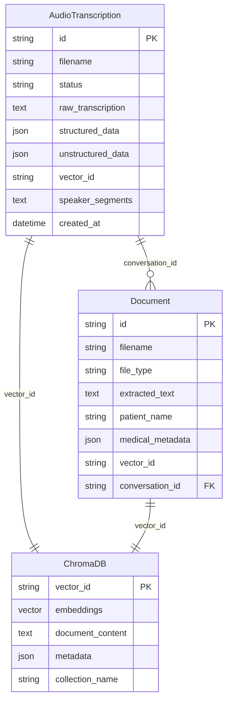

## Flujo de Procesamiento de Documentos

```mermaid
flowchart LR
    A[Upload PDF/Imagen] --> B{Tipo de Archivo}
    
    B -->|PDF| C[PyPDF2 Extraction]
    B -->|Imagen| D[Tesseract OCR]
    
    C --> E[Texto Extraído]
    D --> E
    
    E --> F[OCR Service]
    F --> G[Limpieza de Texto]
    G --> H[OpenAI Service]
    H --> I[Extracción Metadata Médica]
    
    I --> J[Document Model DB]
    I --> K[Vector Store Service]
    K --> L[Embeddings Generation]
    L --> M[ChromaDB Storage]
    
    J --> N[API Response]
    M --> N
    
    style A fill:#e3f2fd
    style C fill:#fff3e0
    style D fill:#fff3e0
    style H fill:#e8f5e8
    style K fill:#f3e5f5
    style M fill:#ffebee
```

## Arquitectura de Servicios

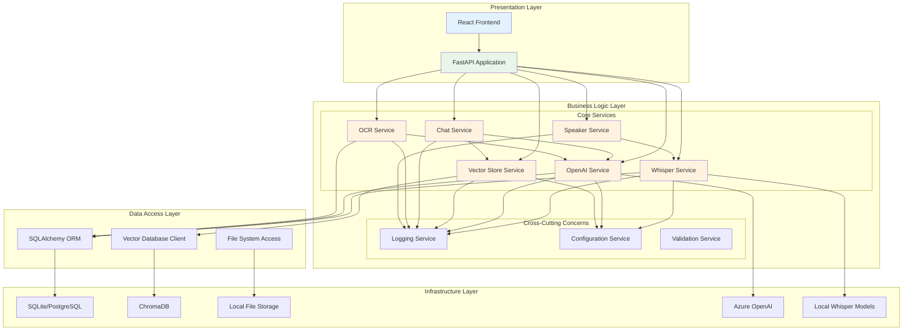

## Patrones de Diseño Implementados

### 1. Service Layer Pattern
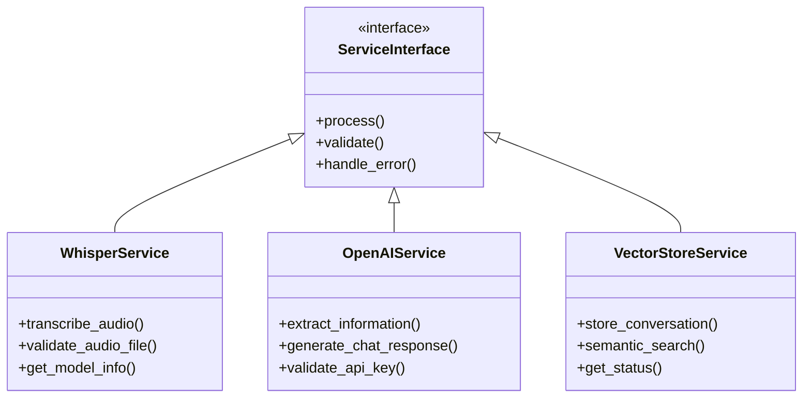

### 2. Repository Pattern
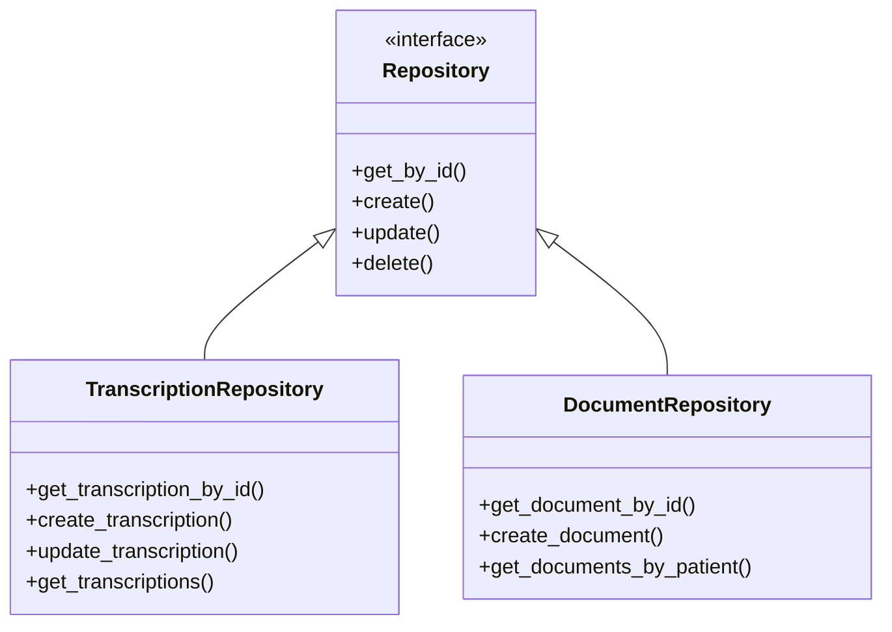

### 3. Dependency Injection Pattern
```python
# FastAPI Dependency Injection
@app.post("/upload-audio")
async def upload_audio(
    file: UploadFile,
    whisper_service: WhisperService = Depends(get_whisper_service),
    db: Session = Depends(get_db)
):
    # Service injection automático
    pass
```

## Configuración y Despliegue

### Estructura de Configuración
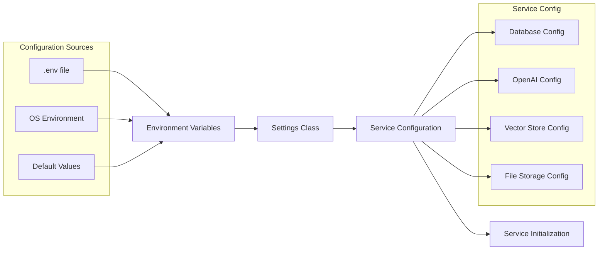

### Arquitectura de Despliegue

```mermaid
deployment
    node "Development Environment" {
        component [FastAPI App]
        database [SQLite DB]
        artifact [Local Files]
        component [ChromaDB Local]
    }
    
    node "Production Environment" {
        component [FastAPI App Load Balanced]
        database [PostgreSQL Cluster]
        artifact [S3/MinIO Storage]
        component [ChromaDB Distributed]
        component [Redis Cache]
        component [Nginx Reverse Proxy]
    }
    
    cloud "External Services" {
        component [Azure OpenAI]
        component [Monitoring Services]
        component [Backup Services]
    }
```

## Escalabilidad y Performance

### Estrategias de Escalabilidad
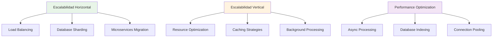

### Caching Strategy
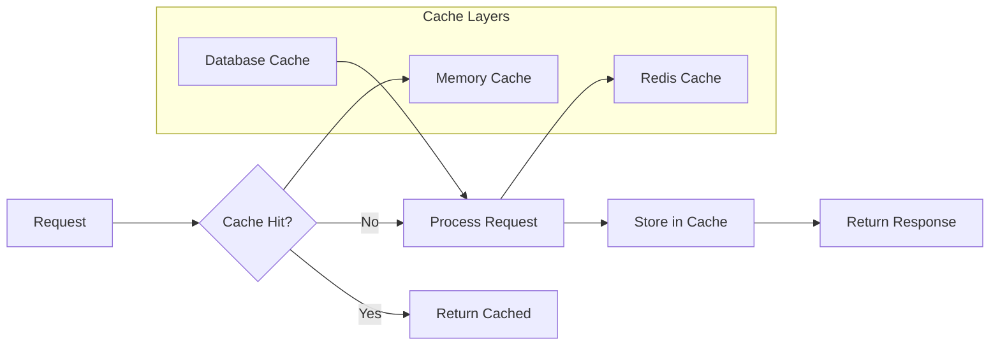

## Seguridad y Compliance

### Arquitectura de Seguridad
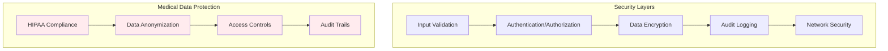

## Monitoreo y Observabilidad

### Monitoring Architecture
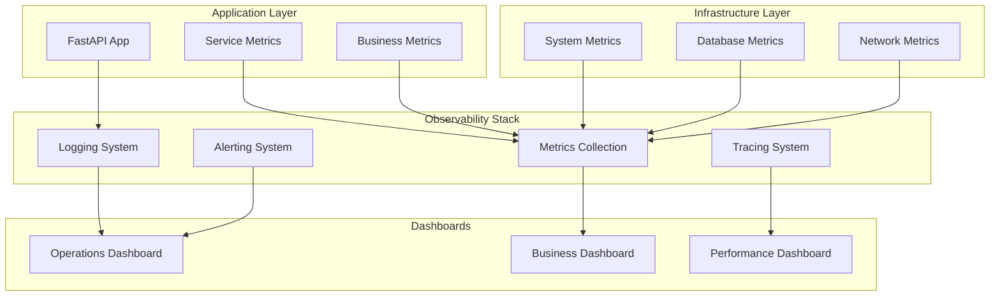

## Evolución hacia Microservicios

### Microservices Target Architecture
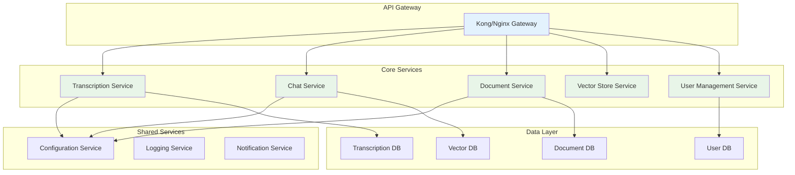

## Decisiones Arquitectónicas Clave

### 1. Monolito Modular vs Microservicios
**Decisión:** Comenzar con monolito modular
**Razones:**
- Simplicidad de desarrollo y despliegue
- Menor complejidad operacional
- Equipos pequeños
- Funcionalidades fuertemente acopladas

### 2. SQLite vs PostgreSQL
**Decisión:** SQLite para desarrollo, PostgreSQL para producción
**Razones:**
- SQLite: Sin configuración, ideal para desarrollo
- PostgreSQL: Escalabilidad, concurrencia, características avanzadas

### 3. ChromaDB vs Alternatives
**Decisión:** ChromaDB para vector storage
**Razones:**
- Simplicidad de uso
- Persistencia local
- Integración nativa con embeddings
- No requiere infrastructure compleja

### 4. Whisper Local vs API
**Decisión:** Whisper local
**Razones:**
- Control total sobre datos médicos sensibles
- No dependencia de conectividad
- Costos predecibles
- Latencia controlada

### 5. FastAPI vs Alternatives
**Decisión:** FastAPI
**Razones:**
- Performance excepcional
- Type hints nativos
- Documentación automática
- Ecosistema Python ML

## Consideraciones Futuras

### Roadmap Técnico
1. **Fase 1**: Monolito estable con todas las características
2. **Fase 2**: Optimización de performance y escalabilidad
3. **Fase 3**: Migración gradual a microservicios
4. **Fase 4**: Multi-tenancy y características enterprise

### Mejoras Planificadas
- Real-time transcription con WebSockets
- Advanced speaker diarization con deep learning
- Multi-language support
- Mobile app integration
- Advanced analytics y reporting
- Integration con sistemas hospitalarios (HL7 FHIR)
